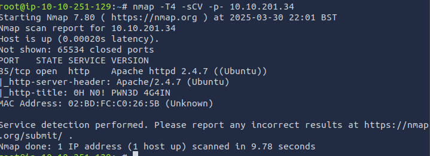

First I ran the namp command nmap -T4 -sCV -p- 10.10.201.34 initially to see what ports are open on this host.

We can see that only 1 port is open on this host, and that being HTTP over port 85.

 When we browse to the victim IP + port 85, we are greeted with this webpage. Looking around, there is nothing to interact within this page and checking the page source brings back nothing.
Next step here, I wanted to enumerate any potential sub directories this site may have that could lead to other webpages.

 
 After running Gobuster (a popular directory and subdomain enumeration tool), I was able to find a hidden directory '/app'.

 When I browse to <victimIP>:85/app, I am greeted with a new webpage titled 'Toad's' Website. Here there is many interesting points to look through such as a contact form and a blog page. The most interesting part of this page to me is the login page for the admin portal.

 Here I was prompted to enter a username and password to access the admin portal. I first started attempting default/generic credentials for login pages and to my luck, it worked with admin:password.

 Now that I have access to the admin portal, I started looking around for potential points to move further into this machine. Looking at the vendor version of this website, I can see that its running on concrete5 CMS.
I started searching for potential exploits that can be used against this vendor to potentially get a shell on the backend server. This is where I found https://hackerone.com/reports/768322 which describes you can get a PHP reverse shell by abusing the file upload section of the admin portal.

 The first step was to allow-list .php files when being uploaded. The next step was to craft the PHP reverse shell payload. For this I used the online tool revshells.com to create a PHP pentest monkey reverse shell. 

 I copied this code into shell.php and then started a netcat listener on the same port which was 4444.

 The next step was to upload the PHP file to the site via the upload file feature and then execute the file via the URL supplied. After this I successfully received a connection from the server back to my netcat listener.

 
The first thing I do when I get a shell is stabilize the connection using 'python -c 'import pty; pty.spawn("/bin/bash")'' to spawn a bash shell.

After searching around the machine, I found some interesting information located in a database file under the websites config. '/var/www/html/app/castle/application/config$'

 I was able to what looks to be credentials for the user toad.

 

Success!
However searching in the /home directory for Toad, we cannot see the user.txt file. This means this must be located on the other user 'mario' instead. 

 

Looking inside the environments section, we see an unusual encoded token titled 'PWD_token'. Decoding it, we receive 'ikaTeNTANtES', which could potentially be the password for the user mario.

 

Success!
However when trying to cat the user.txt I receive 'permission denied' and when looking at the permissions for the file, it is owned by root?!
No matter! we will just have to get root privileges.

 
Going back to Toads /home directory, we see a smb.txt file. After catting this file out we receive the above image. This took me awhile but I was able to determine this was a hint to use the tool pspy, a process monitoring tool.

 After executing pspy, we see an unusual process which looks to pull a bash script from mkingdom.th, execute it, and save the outcome in /var/log

To our advantage, /etc/hosts file is writable to by mario, the account we have access to. With this our goal is to change the IP related to mkingdom.thm to our attacking machine. With this we may be able to mimic counter.sh on our system but instead, it contains code for a bash reverse shell, hoping we can get root level privileges.

First, I create a backup of /etc/hosts incase of any mistakes I can alwayy revert back to the original. 

 Due to the shell I had on the victim machine, I found it hard to navigate the text editor to change the IP address so I took a different aproach and copied the /etc/hosts details to a file on my attacking machine. Here I created a file called 'replace_hosts'.
 

I then started a HTTP server on my attacking machine and placed 'replace_hosts' in the root directory for easy access. I can then use wget to save the file to the victim machine.

 once the file is on the victim sever, I can use cat replace_hosts > /etc/hosts to overwrite /etc/hosts with the contents on replace_hosts. Meaning, my attacking IP is now the IP for mkingdom.thm

Next step is to create a bash reverse shell that will be executed on the victim server through counter.sh. I used revshells.com to create a generic bash shell on port 1337. Here i also started a netcat listener on my machine. 

 As the bash script is located from a specific directory path, we need to mimic this on the attacking machine. I used mkdir -p to create the file path specified in the process and then saved the new counter.sh in the application directory.

The final step is to create a HTTP server over port 85 so the process can communicate with the file on our host. As I placed the directory path in the /tmp folder, I need to specifiy the starting directory for this HTTP server using --directory.

 As this is an automated process, all we need to do now is wait for the process to run again and make a connection to the file on our machine. We should see a HTTP 200 request from our HTTP server and shortly after a shell should spawn from our NetCat listener on port 1337.

And with that we now have a root shell on the server and can cat out both the user.txt and root.txt files :)
